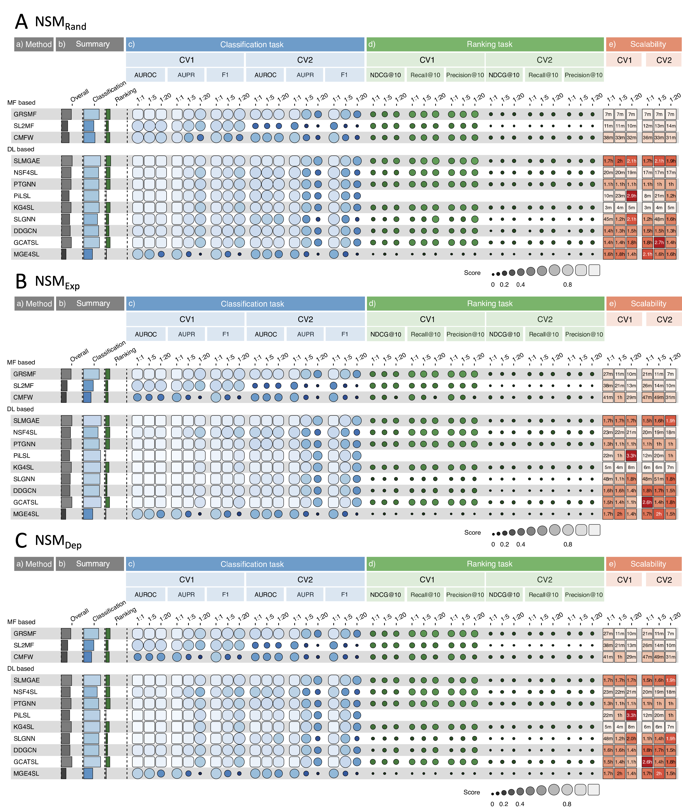

# Benchmarking of Machine Learning Methods for Predicting Synthetic Lethality Interactions

Data set: [](https://doi.org/10.5281/zenodo.14025191)

This work has been published in *Nature Communications*, link to article: [](https://doi.org/10.1038/s41467-024-52900-7)

Welcome to the official code repository for the paper "Benchmarking of Machine Learning Methods for Predicting Synthetic Lethality Interactions." This repository hosts the implementations of various machine learning models evaluated in our study, along with the preprocessing methods and training data necessary for synthetic lethality (SL) prediction.

- [Benchmarking of Machine Learning Methods for Predicting Synthetic Lethality Interactions](#benchmarking-of-machine-learning-methods-for-predicting-synthetic-lethality-interactions)
  - [About the Study](#about-the-study)
  - [Workflow of the benchmarking study](#workflow-of-the-benchmarking-study)
  - [Benchmarking results](#benchmarking-results)
  - [Key Highlights](#key-highlights)
  - [Benchmarked models](#benchmarked-models)
  - [Other SL prediction models](#other-sl-prediction-models)
    - [Machine Learning-Based Methods](#machine-learning-based-methods)
    - [Deep Learning-Based Methods](#deep-learning-based-methods)
  - [Repository Structure](#repository-structure)
  - [How to use](#how-to-use)
    - [Enviroment Preparation](#enviroment-preparation)
    - [Data Preparation and Download Instructions](#data-preparation-and-download-instructions)
    - [Run models](#run-models)
  - [Future directions](#future-directions)
  - [Cite article](#cite-article)

## About the Study
Our research conducts a thorough benchmark of recent machine learning methods, including three matrix factorization and eight deep learning models. We rigorously test model performance under diverse data splitting scenarios, negative sample ratios, and sampling methods. The focus is on both classification and ranking tasks, aiming to ascertain the models' generalizability and robustness.

## Workflow of the benchmarking study


## Benchmarking results
The following graph depicts the performance of the machine learning models across various scenarios:


**A**, **B** and **C** represent the model performance under different negative sampling methods (`NSM_Rand`, `NSM_Exp` and `NSM_Dep`), where lighter colors indicate better performance. The figure is structured into five key sections:
- **a)** A list of the 11 models.
- **b)** The overall scores of the models along with combined scores for the classification task and the ranking task.
- **c)** and **d)** Model performances under the classification and ranking tasks across six experimental scenarios, which include 2 Data Splitting Methods (DSMs) and 3 Positive to Negative Ratios (PNRs).
- **e)** The average time required for the models to complete one round of cross-validation.


## Key Highlights
- Extensive benchmarking of ML models tailored for SL prediction.
- Evaluation of model performance in varied experimental conditions.
- Examination of the impact of data manipulation on model outcomes.

## Benchmarked models

| Method  | Paper Title | Article Link | Code Link |
|---------|-------------|--------------|-----------|
| GRSMF   | Predicting synthetic lethal interactions in human cancers using graph regularized self-representative matrix factorization      | [GRSMF](https://doi.org/10.1186/s12859-019-3197-3)| [GRSMF](https://github.com/lichenbiostat/GCATSL/tree/master/baseline%20methods/GRSMF) |
| SL2MF   | SL<sup>2</sup>MF: Predicting Synthetic Lethality in Human Cancers via Logistic Matrix Factorization      | [SL2MF](https://doi.org/10.1109/tcbb.2019.2909908)| [SL2MF](https://github.com/stephenliu0423/SL$%5E2$MF) |
| CMFW    | Predicting synthetic lethal interactions using heterogeneous data sources      | [CMFW](https://doi.org/10.1093/bioinformatics/btz893)| [CMFW](https://github.com/lianyh/CMF-W) |
| SLMGAE  | Prediction of Synthetic Lethal Interactions in Human Cancers Using Multi-View Graph Auto-Encoder      | [SLMGAE](https://doi.org/10.1109/jbhi.2021.3079302)| [SLMGAE](https://github.com/DiNg1011/SLMGAE) |
| NSF4SL  | NSF4SL: negative-sample-free contrastive learning for ranking synthetic lethal partner genes in human cancers      | [NSF4SL](https://doi.org/10.1093/bioinformatics/btac462)| [NSF4SL](https://github.com/JieZheng-ShanghaiTech/NSF4SL) |
| PTGNN   | Pre-training graph neural networks for link prediction in biomedical networks      | [PTGNN](https://doi.org/10.1093/bioinformatics/btac100)| [PTGNN](https://github.com/longyahui/PT-GNN) |
| PiLSL   | PiLSL: pairwise interaction learning-based graph neural network for synthetic lethality prediction in human cancers      | [PiLSL](https://doi.org/10.1093/bioinformatics/btac476)| [PiLSL](https://github.com/JieZheng-ShanghaiTech/PiLSL) |
| KG4SL   | KG4SL: knowledge graph neural network for synthetic lethality prediction in human cancers      | [KG4SL](https://doi.org/10.1093/bioinformatics/btab271)| [KG4SL](https://github.com/JieZheng-ShanghaiTech/KG4SL) |
| SLGNN        | SLGNN: Synthetic lethality prediction in human cancers based on factor-aware knowledge graph neural network     | [SLGNN](https://doi.org/10.1093/bioinformatics/btad015)| [SLGNN](https://github.com/zy972014452/SLGNN) |
| DDGCN   | Dual-dropout graph convolutional network for predicting synthetic lethality in human cancers      | [DDGCN](https://doi.org/10.1093/bioinformatics/btaa211)| [DDGCN](https://github.com/CXX1113/Dual-DropoutGCN) |
| GCATSL  | Graph contextualized attention network for predicting synthetic lethality in human cancers     | [GCATSL](https://doi.org/10.1093/bioinformatics/btab110)| [GCATSL](https://github.com/lichenbiostat/GCATSL) |
| MGE4SL  | Predicting Synthetic Lethality in Human Cancers via Multi-Graph Ensemble Neural Network     | [MGE4SL](https://doi.org/10.1109/embc46164.2021.9630716)| [MGE4SL](https://github.com/JieZheng-ShanghaiTech/MGE4SL) |

## Other SL prediction models
### Machine Learning-Based Methods
| Method            | Paper Title | Article Link |
|-------------------|-------------|--------------|
| Paladugu et al.   | Mining protein networks for synthetic genetic interactions      | [Paladugu et al.](https://doi.org/10.1186/1471-2105-9-426)|
| Pandey et al.     | An Integrative Multi-Network and Multi-Classifier Approach to Predict Genetic Interactions      | [Pandey et al.](https://doi.org/10.1371/journal.pcbi.1000928)|
| MetaSL            | In Silico Prediction of Synthetic Lethality by Meta-Analysis of Genetic Interactions, Functions, and Pathways in Yeast and Human Cancer      | [MetaSL](https://doi.org/10.4137/cin.s14026)|
| EXP2SL        | EXP2SL: A Machine Learning Framework for Cell-Line-Specific Synthetic Lethality Prediction      | [EXP2SL](https://doi.org/10.3389/fphar.2020.00112)|
| DiscoverSL        | DiscoverSL: an R package for multi-omic data driven prediction of synthetic lethality in cancers      | [DiscoverSL](https://doi.org/10.1093/bioinformatics/bty673)|
| Li et al.         | Identification of synthetic lethality based on a functional network by using machine learning algorithms      | [Li et al.](https://doi.org/10.1002/jcb.27395)|
| SLant             | Predicting synthetic lethal interactions using conserved patterns in protein interaction networks      | [SLant](https://doi.org/10.1371/journal.pcbi.1006888)|
| Wu et al.         | Synthetic Lethal Interactions Prediction Based on Multiple Similarity Measures Fusion      | [Wu et al.](https://doi.org/10.1007/s11390-021-0866-2)|
| De Kegel et al.   | Comprehensive prediction of robust synthetic lethality between paralog pairs in cancer cell lines      | [De Kegel et al.](https://doi.org/10.1016/j.cels.2021.08.006)|
| PARIS             | Uncovering cancer vulnerabilities by machine learning prediction of synthetic lethality     | [PARIS](https://doi.org/10.1186/s12943-021-01405-8)|
| SBSL              | Overcoming selection bias in synthetic lethality prediction     | [SBSL](https://doi.org/10.1093/bioinformatics/btac523)|
| ELISL             | ELISL: early–late integrated synthetic lethality prediction in cancer | [ELISL](https://doi.org/10.1093/bioinformatics/btad764) |

### Deep Learning-Based Methods
| Method       | Paper Title | Article Link |
|--------------|-------------|--------------|
| MAGCN    | MAGCN: A Multiple Attention Graph Convolution Networks for Predicting Synthetic Lethality     | [MAGCN](https://doi.org/10.1109/TCBB.2022.3221736)|
| MVGCN-iSL    | Multi-view graph convolutional network for cancer cell-specific synthetic lethality prediction     | [MVGCN-iSL](https://doi.org/10.3389/fgene.2022.1103092)|


## Repository Structure
This repository is organized as follows:
- `data/`: This directory is meant to contain the dataset required for training the models. Given the large size of the data files, we have compressed and uploaded them to Google Drive for users to download. 

- `results/`: This directory will store the prediction results of the models. It is currently empty and will be populated with data as you run the models.

- `src/`: Main source directory.
    - `config.py`: Configuration settings for the models.
    - `main.py`: Entry point of the SL prediction models.
    - `models/`: Contains the model implementations used in the study.
        - `*.py`: Each model has its own Python file (e.g., `ddgcn.py`, `gcatsl.py`, etc.).
    - `preprocess.py`: Script for data preprocessing.
    - `summary_metrics.ipynb`: Jupyter notebook for summarizing results.
    - `train/`: Training scripts for each model.
    - `utils/`: Utility scripts that support model operations and data manipulation.
    - `wandb/`: Weights & Biases tracking files for experiment tracking. (It will be automatically created during the runtime.)
    - `preprocess_exp_dep_scores.ipynb`: Notebook detailing preprocessing of experimental dependency scores.

## How to use

### Enviroment Preparation

Establish the working environment for this study using Anaconda.
```bash
conda env create -f SL-Benchmark.yml
```

Additionally, there are several packages that need to be installed through local files.
```bash
conda activate SLBench
pip install ./torch_spline_conv-latest+cu102-cp37-cp37m-linux_x86_64.whl
pip install ./torch_sparse-latest+cu102-cp37-cp37m-linux_x86_64.whl
pip install ./torch_scatter-latest+cu102-cp37-cp37m-linux_x86_64.whl
pip install ./torch_cluster-latest+cu102-cp37-cp37m-linux_x86_64.whl
```

### Data Preparation and Download Instructions

Follow these steps to download and prepare the training data:

**Step 1:** Download all the data parts from the [Zenodo link](https://doi.org/10.5281/zenodo.13691648) provided in the repository.

> \[!TIP]
>
> The actual command will depend on how you're downloading files from Google Drive. For the convenience of downloading, the files have been compressed and split.


> \[!IMPORTANT]
>
> We have prepared two versions of data, namely the complete version (`data_large.tar.gz`) and the version without PiLSL database (`data_small.tar.gz`).
> 
> The decompressed size of the complete version is about 90GB, while the decompressed size of the version without PiLSL database is about 22GB.
>
> (Due to the extremely time-consuming database construction process, it is recommended to download the complete version of the data.
> However, the data version without PiLSL database can successfully run all 10 models except PiLSL.)

**Step 2:** Combine the parts into a single archive.
```bash
cat data_large.tar.gz.part* > data_large.tar.gz     # Complete version, the size after extracted is about 100GB.
# cat data_small.tar.gz.part* > data_small.tar.gz   # The version without PiLSL database, the size after extracted is about 25GB.
```
**Step 3:** Verify the integrity of the downloaded files.
```bash
md5sum -c data_large.tar.gz.md5
# md5sum -c data_small.tar.gz.md5 # The version without PiLSL database
```
**Step 4:** Extract the dataset.
```bash
tar -xzvf data_large.tar.gz
# tar -xzvf data_small.tar.gz # The version without PiLSL database
```

### Run models
```bash
# Navigate to the src directory
cd path/to/results
mkdir Rand_score_mats Exp_score_mats Dep_score_mats score_dist
cd path/to/src
python main.py -m SLMGAE \ # Choose the SL prediction method among 'GRSMF', 'SL2MF', 'CMFW', 'SLMGAE', 'NSF4SL', 'PTGNN', 'PiLSL', 'KG4SL', 'SLGNN', 'DDGCN', 'GCATSL' and 'MGE4SL'.
               -ns Rand \ # Choose the negative sampling method with 'Rand', 'Exp', or 'Dep'.
               -ds CV1 \ # Select the data splitting method with 'CV1', 'CV2', or 'CV3'.
               -pn 1 \ # Set the positive to negative ratio with '1', '5', '20', or '50'.
               --save_mat # Save the score matrix for model predictions. (This may take up a lot of disk space.)
```

> \[!TIP]
>
> Considering that network conditions may affect the initialization of `wandb`, we recommend keeping `wandb`'s log data locally by using the following command:
> `wandb offline`
> When you need to upload this data to the Wandb server, you can use the following command line to upload all local logs to the cloud:
> `wandb sync --include-offline`

> \[!IMPORTANT]
>
> Ensure you have at least 500GB of free space to store training data and model prediction results

## Future directions
Beyond providing the necessary tools for SL prediction, this repository serves as a foundation for future improvements in the predictive accuracy and interpretability of ML methods in SL discovery.

We encourage the scientific community to leverage this repository for advancing the research in synthetic lethality and the pursuit of precision medicine in oncology.

## Cite article

```bibtex
@article{feng2024benchmarking,  
  title={Benchmarking machine learning methods for synthetic lethality prediction in cancer},  
  author={Feng, Yimiao and Long, Yahui and Wang, He and Ouyang, Yang and Li, Quan and Wu, Min and Zheng, Jie},  
  journal={Nature Communications},  
  volume={15},  
  number={1},  
  pages={9058},  
  year={2024},  
  publisher={Nature Publishing Group UK London}  
}
```
